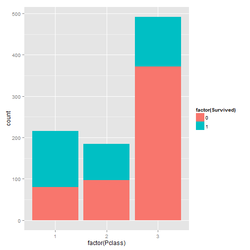
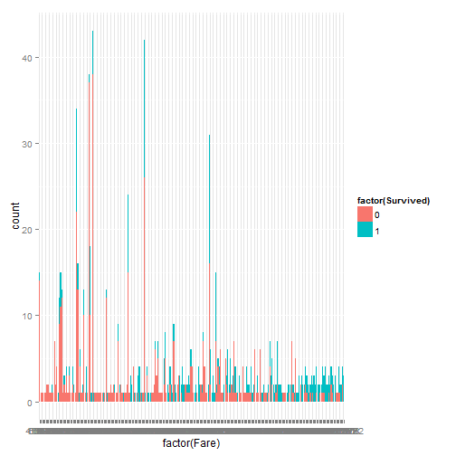
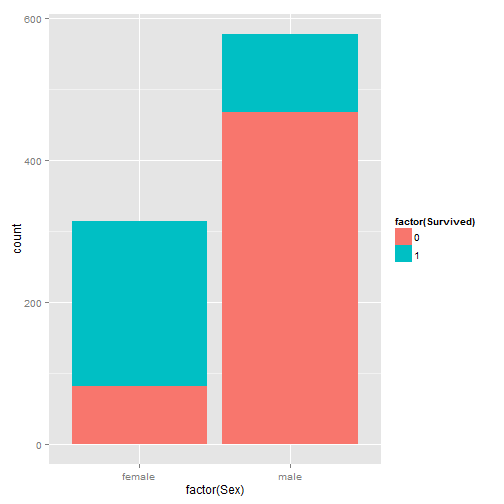
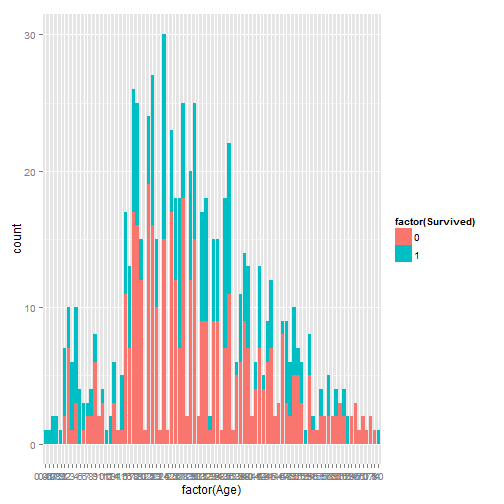
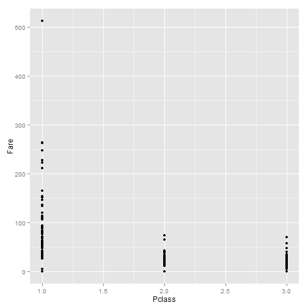
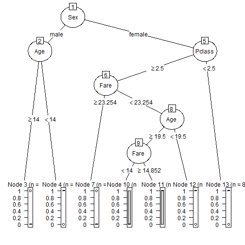
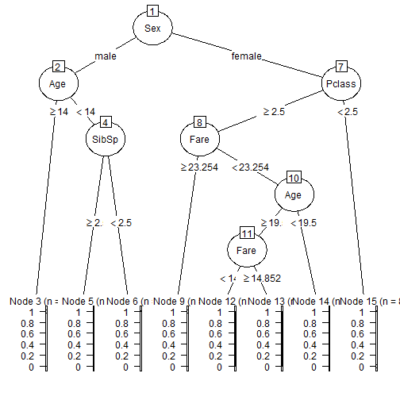
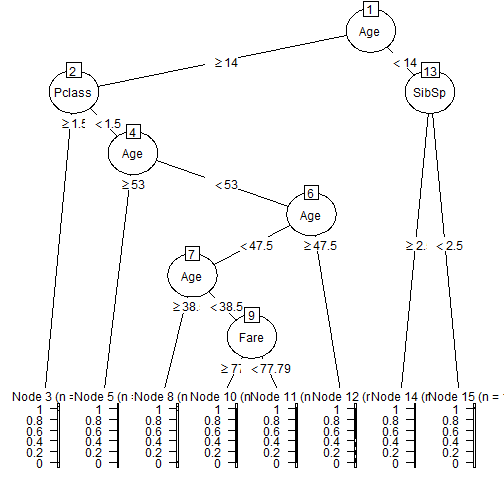
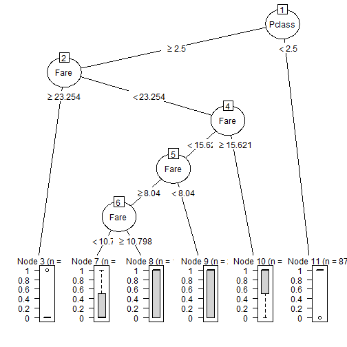

## Problem Description
### Competition Task: Titanic
The task is to predict whether a passenger survived on Titanic or not given the passenger's attributes in the archive data, e.g. age, sex, number of siblings or spouses aboard, number of parents or children on board, passenger class, ticket fare paid, etc. 
[link]https://www.kaggle.com/c/titanic

### Evaluation:
The accuracy of the predict model will be calculated by comparing the predicted result with the ground truth using the testing data set.

### Data:
Kaggle has separated the data into train.csv and test.csv. Here, the summary and some simple analysis are run to have brief idea about the data (training set).

###### Note: (Source: Kaggle.com)
###### survival        Survival
######                (0 = No; 1 = Yes)
###### pclass          Passenger Class (1 = 1st; 2 = 2nd; 3 = 3rd)
###### name            Name
###### sex             Sex
###### age             Age
###### sibsp           Number of Siblings/Spouses Aboard
###### parch           Number of Parents/Children Aboard
###### ticket          Ticket Number
###### fare            Passenger Fare
###### cabin           Cabin
###### embarked        Port of Embarkation (C = Cherbourg; Q = Queenstown; S = Southampton)

* Training Data Summary

```
##   PassengerId       Survived          Pclass     
##  Min.   :  1.0   Min.   :0.0000   Min.   :1.000  
##  1st Qu.:223.5   1st Qu.:0.0000   1st Qu.:2.000  
##  Median :446.0   Median :0.0000   Median :3.000  
##  Mean   :446.0   Mean   :0.3838   Mean   :2.309  
##  3rd Qu.:668.5   3rd Qu.:1.0000   3rd Qu.:3.000  
##  Max.   :891.0   Max.   :1.0000   Max.   :3.000  
##                                                  
##                                     Name         Sex           Age       
##  Abbing, Mr. Anthony                  :  1   female:314   Min.   : 0.42  
##  Abbott, Mr. Rossmore Edward          :  1   male  :577   1st Qu.:20.12  
##  Abbott, Mrs. Stanton (Rosa Hunt)     :  1                Median :28.00  
##  Abelson, Mr. Samuel                  :  1                Mean   :29.70  
##  Abelson, Mrs. Samuel (Hannah Wizosky):  1                3rd Qu.:38.00  
##  Adahl, Mr. Mauritz Nils Martin       :  1                Max.   :80.00  
##  (Other)                              :885                NA's   :177    
##      SibSp           Parch             Ticket         Fare       
##  Min.   :0.000   Min.   :0.0000   1601    :  7   Min.   :  0.00  
##  1st Qu.:0.000   1st Qu.:0.0000   347082  :  7   1st Qu.:  7.91  
##  Median :0.000   Median :0.0000   CA. 2343:  7   Median : 14.45  
##  Mean   :0.523   Mean   :0.3816   3101295 :  6   Mean   : 32.20  
##  3rd Qu.:1.000   3rd Qu.:0.0000   347088  :  6   3rd Qu.: 31.00  
##  Max.   :8.000   Max.   :6.0000   CA 2144 :  6   Max.   :512.33  
##                                   (Other) :852                   
##          Cabin     Embarked
##             :687    :  2   
##  B96 B98    :  4   C:168   
##  C23 C25 C27:  4   Q: 77   
##  G6         :  4   S:644   
##  C22 C26    :  3           
##  D          :  3           
##  (Other)    :186
```

* First Look

Some attributes (i.e.names, passengerid, ticket, embark, and cabin) seems either not to be relevant to a passenger's survival rate or to be sparse. Therefore, they are not included in the following analyses.   

From the correlation table, it seems like the survival rate is relatively highly correlated with Pclass and Sex.The correlation between age and survival rate is not yet clear. Not surprisingly, Pclass is highly correlated with Fare.


```
##             Survived         Sex      Pclass         Age       SibSp
## Survived  1.00000000 -0.53882559 -0.35965268 -0.07722109 -0.01735836
## Sex      -0.53882559  1.00000000  0.15546030  0.09325358 -0.10394968
## Pclass   -0.35965268  0.15546030  1.00000000 -0.36922602  0.06724737
## Age      -0.07722109  0.09325358 -0.36922602  1.00000000 -0.30824676
## SibSp    -0.01735836 -0.10394968  0.06724737 -0.30824676  1.00000000
## Parch     0.09331701 -0.24697204  0.02568307 -0.18911926  0.38381986
## Fare      0.26818862 -0.18499425 -0.55418247  0.09606669  0.13832879
##                Parch        Fare
## Survived  0.09331701  0.26818862
## Sex      -0.24697204 -0.18499425
## Pclass    0.02568307 -0.55418247
## Age      -0.18911926  0.09606669
## SibSp     0.38381986  0.13832879
## Parch     1.00000000  0.20511888
## Fare      0.20511888  1.00000000
```

The follwoing figures also show similar informaiton.

     

## Analysis Approach
I further separate the training data provided by Kaggle further into two sets for training and testing purpose.

### Split Data

```r
library("caret")
train_F<-train[which(train[,"Sex"]=="female"),]
train_M<-train[which(train[,"Sex"]=="male"),]
train_index_f<-createDataPartition(1:nrow(train_F),1,.5,list=F)
train_index_m<-createDataPartition(1:nrow(train_M),1,.5,list=F)

trainset_f<-train_F[train_index_f,]
testset_f<-train_F[-train_index_f,]

trainset_m<-train_M[train_index_m,]
testset_m<-train_M[-train_index_m,]

trainset<-rbind(trainset_f,trainset_m )
testset<-rbind(testset_f,testset_m)
#trainset<-train[train_index,]
#testset<-train[-train_index,]
```

Based on the information learned from the correlation table and figures above, I consider including Sex, Age, Pclass/Fare in the model first.

First, a quick decision tree is built based on the training set to see what attributes are the key factors to survivl rate. 

Second, a random forest tree is built based on the attributes selected from the first step.

## Initial Solution and Initial Solution Analysis
* Single Tree

It shows that Sex is the most important key factor, followed by Pclass (for female) and Fare (fore male).

### Building Decision Tree

```r
library("rpart")
library("partykit")
fol<- formula(Survived~Sex+Pclass+Fare+Age)

model_dt <- rpart(fol, method="class", data=trainset)
print(model_dt)
```

```
## n= 447 
## 
## node), split, n, loss, yval, (yprob)
##       * denotes terminal node
## 
##  1) root 447 182 0 (0.59284116 0.40715884)  
##    2) Sex=male 289  63 0 (0.78200692 0.21799308)  
##      4) Age>=14 267  46 0 (0.82771536 0.17228464) *
##      5) Age< 14 22   5 1 (0.22727273 0.77272727) *
##    3) Sex=female 158  39 1 (0.24683544 0.75316456)  
##      6) Pclass>=2.5 71  34 0 (0.52112676 0.47887324)  
##       12) Fare>=23.25415 16   2 0 (0.87500000 0.12500000) *
##       13) Fare< 23.25415 55  23 1 (0.41818182 0.58181818)  
##         26) Age>=19.5 33  15 0 (0.54545455 0.45454545)  
##           52) Fare< 14.85205 24   9 0 (0.62500000 0.37500000) *
##           53) Fare>=14.85205 9   3 1 (0.33333333 0.66666667) *
##         27) Age< 19.5 22   5 1 (0.22727273 0.77272727) *
##      7) Pclass< 2.5 87   2 1 (0.02298851 0.97701149) *
```

```r
predict_dt<-predict(model_dt,newdata=testset)
accuracy_dt<-sum(testset[,'Survived']==colnames(predict_dt)[apply(predict_dt,1,which.max)])/dim(predict_dt)[1]
print(c("accuracy: ", accuracy_dt))
```

```
## [1] "accuracy: "        "0.797297297297297"
```

```r
plot_dt<- as.party(model_dt)
plot(plot_dt)
```

 

Given that Pcalss and Fare are highly correlated, it makes sense to just use one attribute instead of two in the model. Therefore, I first run the model including Sex, Age, and Pclass.

### Remove Fare

```r
fol<- formula(Survived~Sex+Pclass+Age)
model_dt <- rpart(fol, method="class", data=trainset)
print(model_dt)
```

```
## n= 447 
## 
## node), split, n, loss, yval, (yprob)
##       * denotes terminal node
## 
##  1) root 447 182 0 (0.59284116 0.40715884)  
##    2) Sex=male 289  63 0 (0.78200692 0.21799308)  
##      4) Age>=14 267  46 0 (0.82771536 0.17228464) *
##      5) Age< 14 22   5 1 (0.22727273 0.77272727) *
##    3) Sex=female 158  39 1 (0.24683544 0.75316456)  
##      6) Pclass>=2.5 71  34 0 (0.52112676 0.47887324)  
##       12) Age>=19.5 45  17 0 (0.62222222 0.37777778) *
##       13) Age< 19.5 26   9 1 (0.34615385 0.65384615) *
##      7) Pclass< 2.5 87   2 1 (0.02298851 0.97701149) *
```

```r
predict_dt<-predict(model_dt,newdata=testset)
accuracy_dt<-sum(testset[,'Survived']==colnames(predict_dt)[apply(predict_dt,1,which.max)])/dim(predict_dt)[1]
print(c("accuracy: ", accuracy_dt))
```

```
## [1] "accuracy: "        "0.768018018018018"
```

### Remove Pclass, Add Fare Back

```r
fol<- formula(Survived~Sex+Fare+Age)
model_dt <- rpart(fol, method="class", data=trainset)
print(model_dt)
```

```
## n= 447 
## 
## node), split, n, loss, yval, (yprob)
##       * denotes terminal node
## 
## 1) root 447 182 0 (0.5928412 0.4071588)  
##   2) Sex=male 289  63 0 (0.7820069 0.2179931)  
##     4) Age>=14 267  46 0 (0.8277154 0.1722846) *
##     5) Age< 14 22   5 1 (0.2272727 0.7727273) *
##   3) Sex=female 158  39 1 (0.2468354 0.7531646) *
```

```r
predict_dt<-predict(model_dt,newdata=testset)
accuracy_dt<-sum(testset[,'Survived']==colnames(predict_dt)[apply(predict_dt,1,which.max)])/dim(predict_dt)[1]
print(c("accuracy: ", accuracy_dt))
```

```
## [1] "accuracy: "        "0.786036036036036"
```

The three models shows that including both Pclass and Fare in the model would produce higher accuracy.

### Remove Age

```r
fol<- formula(Survived~Sex+Pclass+Fare)
model_dt <- rpart(fol, method="class", data=trainset)
print(model_dt)
```

```
## n= 447 
## 
## node), split, n, loss, yval, (yprob)
##       * denotes terminal node
## 
##  1) root 447 182 0 (0.59284116 0.40715884)  
##    2) Sex=male 289  63 0 (0.78200692 0.21799308) *
##    3) Sex=female 158  39 1 (0.24683544 0.75316456)  
##      6) Pclass>=2.5 71  34 0 (0.52112676 0.47887324)  
##       12) Fare>=23.25415 16   2 0 (0.87500000 0.12500000) *
##       13) Fare< 23.25415 55  23 1 (0.41818182 0.58181818) *
##      7) Pclass< 2.5 87   2 1 (0.02298851 0.97701149) *
```

```r
predict_dt<-predict(model_dt,newdata=testset)
accuracy_dt<-sum(testset[,'Survived']==colnames(predict_dt)[apply(predict_dt,1,which.max)])/dim(predict_dt)[1]
print(c("accuracy: ", accuracy_dt))
```

```
## [1] "accuracy: "        "0.822072072072072"
```

## Revised Solution and Analysis
* Random Forest

I train a random forest model with the same attributed used in previous section.

### Build a Random Forest

#### Include Age

```r
library("randomForest")
library("e1071")

fol<- formula(Survived~Sex+Age+Pclass+Fare)

model_rf <- randomForest(fol, data=trainset,na.action=na.omit)
#model_rf <- randomForest(fol, data=trainset,importance=T,keep.forest=T)
#testing
predict_rf<-predict(model_rf,newdata=testset)
survival<-which(predict_rf>.5)
predict_rf[survival]<-1
predict_rf[-survival]<-0
accuracy_rf<-(sum(predict_rf==testset[,'Survived']))/length(predict_rf)
print(c("accuracy: ",accuracy_rf))
```

```
## [1] "accuracy: "        "0.779279279279279"
```

```r
#Gini coef 
#"The higher the number, the more the gini impurity score decreases by branching on this variable, indicating that the variable is more important"
importance(model_rf)
```

```
##        IncNodePurity
## Sex        17.843024
## Age         9.912245
## Pclass      7.408259
## Fare       10.003405
```

#### Remove Age

```r
library("randomForest")
library("e1071")

fol<- formula(Survived~Sex+Pclass+Fare)

model_rf <- randomForest(fol, data=trainset,na.action=na.omit)
#model_rf <- randomForest(fol, data=trainset,importance=T,keep.forest=T)
#testing
predict_rf<-predict(model_rf,newdata=testset)
survival<-which(predict_rf>.5)
predict_rf[survival]<-1
predict_rf[-survival]<-0
accuracy_rf<-(sum(predict_rf==testset[,'Survived']))/length(predict_rf)
print(c("accuracy: ",accuracy_rf))
```

```
## [1] "accuracy: "        "0.806306306306306"
```

```r
#Gini coef 
#"The higher the number, the more the gini impurity score decreases by branching on this variable, indicating that the variable is more important"
importance(model_rf)
```

```
##        IncNodePurity
## Sex        22.581985
## Pclass      7.548184
## Fare       10.952525
```


Interesting, a forest is not necessarily better than a tree.

Then, I am interested to know wheter adding SibSp and Parch in the model will change the accuracy and how important each attribute is. As we can see Sex is the most important factor to surival rate, followed by Fare and Sex. 

### Add SibSp and Parch

```r
fol<- formula(Survived~Age+Sex+Pclass+Fare+SibSp+Parch)

model_rf <- randomForest(fol, data=trainset,na.action=na.omit)
#model_rf <- randomForest(fol, data=trainset,importance=T,keep.forest=T)
#testing
predict_rf<-predict(model_rf,newdata=testset)
survival<-which(predict_rf>.5)
predict_rf[survival]<-1
predict_rf[-survival]<-0
accuracy_rf<-(sum(predict_rf==testset[,'Survived']))/length(predict_rf)
print(c("accuracy: ",accuracy_rf))
```

```
## [1] "accuracy: "        "0.795045045045045"
```

```r
#Gini coef 
#"The higher the number, the more the gini impurity score decreases by branching on this variable, indicating that the variable is more important"
importance(model_rf)
```

```
##        IncNodePurity
## Age        15.958996
## Sex        20.729957
## Pclass      8.379835
## Fare       14.673145
## SibSp       3.832999
## Parch       3.447541
```

#### Build a Random Forest for Each Gender
##### Male

```r
fol<- formula(Survived~Age+Pclass+Fare+SibSp+Parch)

model_rf <- randomForest(fol, data=trainset_m,na.action=na.omit)
#model_rf <- randomForest(fol, data=trainset,importance=T,keep.forest=T)
#testing
predict_rf_m<-predict(model_rf,newdata=testset_m)
survival<-which(predict_rf_m>.5)
predict_rf_m[survival]<-1
predict_rf_m[-survival]<-0
accuracy_rf<-(sum(predict_rf_m==testset_m[,'Survived']))/length(predict_rf_m)
print(c("accuracy: ",accuracy_rf))
```

```
## [1] "accuracy: "        "0.850694444444444"
```

```r
#Gini coef 
#"The higher the number, the more the gini impurity score decreases by branching on this variable, indicating that the variable is more important"
importance(model_rf)
```

```
##        IncNodePurity
## Age         7.237436
## Pclass      2.051254
## Fare        4.325410
## SibSp       1.496156
## Parch       1.787245
```

##### Female

```r
fol<- formula(Survived~Age+Pclass+Fare+SibSp+Parch)

model_rf <- randomForest(fol, data=trainset_f,na.action=na.omit)
#model_rf <- randomForest(fol, data=trainset,importance=T,keep.forest=T)
#testing
predict_rf_f<-predict(model_rf,newdata=testset_f)
survival<-which(predict_rf_f>.5)
predict_rf_f[survival]<-1
predict_rf_f[-survival]<-0
accuracy_rf<-(sum(predict_rf_f==testset_f[,'Survived']))/length(predict_rf_f)
print(c("accuracy: ",accuracy_rf))
```

```
## [1] "accuracy: "        "0.685897435897436"
```

```r
#Gini coef 
#"The higher the number, the more the gini impurity score decreases by branching on this variable, indicating that the variable is more important"
importance(model_rf)
```

```
##        IncNodePurity
## Age         2.908656
## Pclass      4.674585
## Fare        3.818898
## SibSp       1.426407
## Parch       2.034892
```

#### Combining Female and Male data set to get the accuracy

```r
predict_rf_mix<-c(predict_rf_m,predict_rf_f)
truth_mix<-c(testset_m[,'Survived'],testset_f[,'Survived'])
accuracy_rf<-(sum(predict_rf_mix==truth_mix))/length(predict_rf_mix)
print(c("accuracy: ",accuracy_rf))
```

```
## [1] "accuracy: "        "0.792792792792793"
```


Based on previous sections, we see that a single tree might be better than a forest. I decided to run a model with a signle tree considering additonal attributes, SibSp and Parch.

### Rebuild a Decision Tree and Add SibSp and Parch

```r
fol<- formula(Survived~Age+Sex+Pclass+Fare+SibSp+Parch)

model_dt <- rpart(fol, method="class", data=trainset)
print(model_dt)
```

```
## n= 447 
## 
## node), split, n, loss, yval, (yprob)
##       * denotes terminal node
## 
##  1) root 447 182 0 (0.59284116 0.40715884)  
##    2) Sex=male 289  63 0 (0.78200692 0.21799308)  
##      4) Age>=14 265  46 0 (0.82641509 0.17358491) *
##      5) Age< 14 24   7 1 (0.29166667 0.70833333)  
##       10) SibSp>=2.5 7   0 0 (1.00000000 0.00000000) *
##       11) SibSp< 2.5 17   0 1 (0.00000000 1.00000000) *
##    3) Sex=female 158  39 1 (0.24683544 0.75316456)  
##      6) Pclass>=2.5 71  34 0 (0.52112676 0.47887324)  
##       12) Fare>=23.25415 16   2 0 (0.87500000 0.12500000) *
##       13) Fare< 23.25415 55  23 1 (0.41818182 0.58181818)  
##         26) Age>=19.5 34  15 0 (0.55882353 0.44117647)  
##           52) Fare< 14.85205 26  10 0 (0.61538462 0.38461538) *
##           53) Fare>=14.85205 8   3 1 (0.37500000 0.62500000) *
##         27) Age< 19.5 21   4 1 (0.19047619 0.80952381) *
##      7) Pclass< 2.5 87   2 1 (0.02298851 0.97701149) *
```

```r
predict_dt<-predict(model_dt,newdata=testset)
accuracy_dt<-sum(testset[,'Survived']==colnames(predict_dt)[apply(predict_dt,1,which.max)])/dim(predict_dt)[1]
print(c("accuracy: ",accuracy_dt))
```

```
## [1] "accuracy: "        "0.810810810810811"
```

```r
plot_dt<- as.party(model_dt)
plot(plot_dt)
```

 


### Rebuild Decision Trees for Each Gender
#### Male

```r
fol<- formula(Survived~Age+Pclass+Fare+SibSp+Parch)

model_dt <- rpart(fol, method="class", data=trainset_m)
print(model_dt)
```

```
## n= 289 
## 
## node), split, n, loss, yval, (yprob)
##       * denotes terminal node
## 
##  1) root 289 63 0 (0.78200692 0.21799308)  
##    2) Age>=14 265 46 0 (0.82641509 0.17358491)  
##      4) Pclass>=1.5 198 23 0 (0.88383838 0.11616162) *
##      5) Pclass< 1.5 67 23 0 (0.65671642 0.34328358)  
##       10) Age>=53 13  1 0 (0.92307692 0.07692308) *
##       11) Age< 53 54 22 0 (0.59259259 0.40740741)  
##         22) Age< 47.5 46 16 0 (0.65217391 0.34782609)  
##           44) Age>=38.5 23  4 0 (0.82608696 0.17391304) *
##           45) Age< 38.5 23 11 1 (0.47826087 0.52173913)  
##             90) Fare>=77.7896 11  4 0 (0.63636364 0.36363636) *
##             91) Fare< 77.7896 12  4 1 (0.33333333 0.66666667) *
##         23) Age>=47.5 8  2 1 (0.25000000 0.75000000) *
##    3) Age< 14 24  7 1 (0.29166667 0.70833333)  
##      6) SibSp>=2.5 7  0 0 (1.00000000 0.00000000) *
##      7) SibSp< 2.5 17  0 1 (0.00000000 1.00000000) *
```

```r
predict_dt_m<-predict(model_dt,newdata=testset_m)
accuracy_dt<-sum(testset_m[,'Survived']==colnames(predict_dt_m)[apply(predict_dt_m,1,which.max)])/dim(predict_dt_m)[1]
print(c("accuracy: ",accuracy_dt))
```

```
## [1] "accuracy: "        "0.840277777777778"
```

```r
plot_dt<- as.party(model_dt)
plot(plot_dt)
```

 

#### Female

```r
fol<- formula(Survived~Pclass+Fare+SibSp+Parch)

model_dt <- rpart(fol, method="class", data=trainset_f)
print(model_dt)
```

```
## n= 158 
## 
## node), split, n, loss, yval, (yprob)
##       * denotes terminal node
## 
##  1) root 158 39 1 (0.24683544 0.75316456)  
##    2) Pclass>=2.5 71 34 0 (0.52112676 0.47887324)  
##      4) Fare>=23.25415 16  2 0 (0.87500000 0.12500000) *
##      5) Fare< 23.25415 55 23 1 (0.41818182 0.58181818)  
##       10) Fare< 15.62085 44 20 1 (0.45454545 0.54545455)  
##         20) Fare>=8.0396 21  9 0 (0.57142857 0.42857143)  
##           40) Fare< 10.7979 11  3 0 (0.72727273 0.27272727) *
##           41) Fare>=10.7979 10  4 1 (0.40000000 0.60000000) *
##         21) Fare< 8.0396 23  8 1 (0.34782609 0.65217391) *
##       11) Fare>=15.62085 11  3 1 (0.27272727 0.72727273) *
##    3) Pclass< 2.5 87  2 1 (0.02298851 0.97701149) *
```

```r
predict_dt_f<-predict(model_dt,newdata=testset_f)
accuracy_dt<-sum(testset_f[,'Survived']==colnames(predict_dt_f)[apply(predict_dt_f,1,which.max)])/dim(predict_dt_f)[1]
print(c("accuracy: ",accuracy_dt))
```

```
## [1] "accuracy: "       "0.82051282051282"
```

```r
plot_dt<- as.party(model_dt)
plot(plot_dt)
```

 


#### Combining Female and Male data set to get the accuracy

```r
predict_dt_mix<-c(colnames(predict_dt_m)[apply(predict_dt_m,1,which.max)],colnames(predict_dt_f)[apply(predict_dt_f,1,which.max)])
truth_mix<-c(testset_m[,'Survived'],testset_f[,'Survived'])
accuracy_dt<-(sum(predict_dt_mix==truth_mix))/length(predict_dt_mix)
print(c("accuracy: ",accuracy_dt))
```

```
## [1] "accuracy: "        "0.833333333333333"
```


#### Build a Random Forest for Each Gender with different formula
##### Male

```r
fol<- formula(Survived~Age+Fare)

model_rf <- randomForest(fol, data=trainset_m,na.action=na.omit)
#model_rf <- randomForest(fol, data=trainset,importance=T,keep.forest=T)
#testing
predict_rf_m<-predict(model_rf,newdata=testset_m)
survival<-which(predict_rf_m>.5)
predict_rf_m[survival]<-1
predict_rf_m[-survival]<-0
accuracy_rf<-(sum(predict_rf_m==testset_m[,'Survived']))/length(predict_rf_m)
print(c("accuracy: ",accuracy_rf))
```

```
## [1] "accuracy: "        "0.829861111111111"
```

```r
#Gini coef 
#"The higher the number, the more the gini impurity score decreases by branching on this variable, indicating that the variable is more important"
importance(model_rf)
```

```
##      IncNodePurity
## Age       18.43268
## Fare      14.74283
```

##### Female

```r
fol<- formula(Survived~Age+Pclass+Fare)

model_rf <- randomForest(fol, data=trainset_f,na.action=na.omit)
#model_rf <- randomForest(fol, data=trainset,importance=T,keep.forest=T)
#testing
predict_rf_f<-predict(model_rf,newdata=testset_f)
survival<-which(predict_rf_f>.5)
predict_rf_f[survival]<-1
predict_rf_f[-survival]<-0
accuracy_rf<-(sum(predict_rf_f==testset_f[,'Survived']))/length(predict_rf_f)
print(c("accuracy: ",accuracy_rf))
```

```
## [1] "accuracy: "       "0.67948717948718"
```

```r
#Gini coef 
#"The higher the number, the more the gini impurity score decreases by branching on this variable, indicating that the variable is more important"
importance(model_rf)
```

```
##        IncNodePurity
## Age         3.671912
## Pclass      6.471015
## Fare        5.119005
```

#### Combining Female and Male data set to get the accuracy

```r
predict_rf_mix<-c(predict_rf_m,predict_rf_f)
truth_mix<-c(testset_m[,'Survived'],testset_f[,'Survived'])
accuracy_rf<-(sum(predict_rf_mix==truth_mix))/length(predict_rf_mix)
print(c("accuracy: ",accuracy_rf))
```

```
## [1] "accuracy: "        "0.777027027027027"
```

## Summary
* Simple model might work better; one concern may be over-fitting
* Notebably, for different gender, the key factors to predict survival rate would be differnt. For male, Fare and SibSp plays the two main factors in predicting survial rate; for female, Pclass and Fare plays two main factors in predicting surval rate 
