Load data into workspace.


```r
library("tree")
library("ggplot2")

seaflow<-read.csv("seaflow_21min.csv",header=T)
summary(seaflow)
```

```
##     file_id           time          cell_id            d1       
##  Min.   :203.0   Min.   : 12.0   Min.   :    0   Min.   : 1328  
##  1st Qu.:204.0   1st Qu.:174.0   1st Qu.: 7486   1st Qu.: 7296  
##  Median :206.0   Median :362.0   Median :14995   Median :17728  
##  Mean   :206.2   Mean   :341.5   Mean   :15008   Mean   :17039  
##  3rd Qu.:208.0   3rd Qu.:503.0   3rd Qu.:22401   3rd Qu.:24512  
##  Max.   :209.0   Max.   :643.0   Max.   :32081   Max.   :54048  
##        d2          fsc_small        fsc_perp        fsc_big     
##  Min.   :   32   Min.   :10005   Min.   :    0   Min.   :32384  
##  1st Qu.: 9584   1st Qu.:31341   1st Qu.:13496   1st Qu.:32400  
##  Median :18512   Median :35483   Median :18069   Median :32400  
##  Mean   :17437   Mean   :34919   Mean   :17646   Mean   :32405  
##  3rd Qu.:24656   3rd Qu.:39184   3rd Qu.:22243   3rd Qu.:32416  
##  Max.   :54688   Max.   :65424   Max.   :63456   Max.   :32464  
##        pe          chl_small        chl_big           pop       
##  Min.   :    0   Min.   : 3485   Min.   :    0   crypto :  102  
##  1st Qu.: 1635   1st Qu.:22525   1st Qu.: 2800   nano   :12698  
##  Median : 2421   Median :30512   Median : 7744   pico   :20860  
##  Mean   : 5325   Mean   :30164   Mean   : 8328   synecho:18146  
##  3rd Qu.: 5854   3rd Qu.:38299   3rd Qu.:12880   ultra  :20537  
##  Max.   :58675   Max.   :64832   Max.   :57184
```

Plot pe against chl_small

```r
ggplot(seaflow,aes(x=pe, y=chl_small,col=pop))+geom_point()
ggplot(seaflow,aes(x=pe, y=chl_small,col=pop))+geom_line()
```
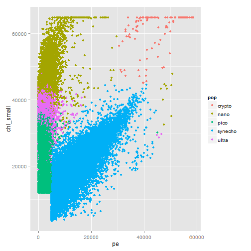 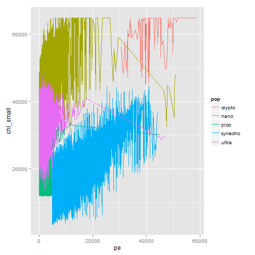 

Partitions


```r
library("caret")
train_index<-createDataPartition(1:nrow(seaflow),1,.5,list=F)
trainset<-seaflow[train_index,]
testset<-seaflow[-train_index,]

mean(trainset[,'time'])
```

```
## [1] 341.7819
```


Decison Tree


```r
library("rpart")
fol<- formula(pop~fsc_small + fsc_perp + fsc_big + pe + chl_big + chl_small)
model_dt <- rpart(fol, method="class", data=trainset)
print(model_dt)
```

```
## n= 36172 
## 
## node), split, n, loss, yval, (yprob)
##       * denotes terminal node
## 
##  1) root 36172 25647 pico (0.0014 0.18 0.29 0.25 0.28)  
##    2) pe< 5006.5 26385 15912 pico (0 0.22 0.4 3.8e-05 0.38)  
##      4) chl_small< 32521.5 11884  2185 pico (0 0.00042 0.82 8.4e-05 0.18) *
##      5) chl_small>=32521.5 14501  6610 ultra (0 0.4 0.053 0 0.54)  
##       10) chl_small>=41113.5 5422   776 nano (0 0.86 0.00018 0 0.14) *
##       11) chl_small< 41113.5 9079  1963 ultra (0 0.13 0.085 0 0.78) *
##    3) pe>=5006.5 9787   745 synecho (0.005 0.051 0.0053 0.92 0.014)  
##      6) chl_small>=38113.5 623   122 nano (0.079 0.8 0 0.058 0.059) *
##      7) chl_small< 38113.5 9164   158 synecho (0 0.00022 0.0057 0.98 0.011) *
```

```r
predict_dt<-predict(model_dt,newdata=testset)
prepop_dt<-cbind(rownames(predict_dt),colnames(predict_dt)[apply(predict_dt,1,which.max)])
accuracy_dt<-(sum(prepop_dt[,2]==seaflow[prepop_dt[,1],'pop']))/dim(prepop_dt)[1]

print(accuracy_dt)
```

```
## [1] 0.8543585
```

```r
library(partykit)
plot_dt<- as.party(model_dt)
plot(plot_dt)
```

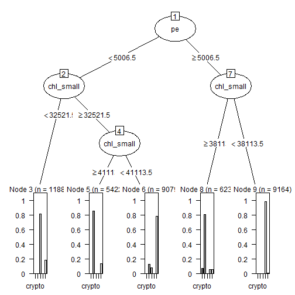 

Radom Forest


```r
library("randomForest")
model_rf <- randomForest(fol, data=trainset)
#model_rf <- randomForest(fol, data=trainset,importance=T,keep.forest=T)
#testing
predict_rf<-predict(model_rf,newdata=testset)
accuracy_rf<-(sum(predict_rf==seaflow[labels(predict_rf),'pop']))/length(predict_rf)
print(accuracy_rf)
```

```
## [1] 0.9202953
```

```r
#Gini coef 
#"The higher the number, the more the gini impurity score decreases by branching on this variable, indicating that the variable is more important"
importance(model_rf)
```

```
##           MeanDecreaseGini
## fsc_small        2807.1101
## fsc_perp         2095.6499
## fsc_big           201.0435
## pe               8891.1414
## chl_big          4846.6091
## chl_small        8008.2609
```

SVM


```r
library("e1071")
#SVM
#model <- svm(fol, data=trainingdata)
model_svm<-svm(fol, data=trainset)
#testing
predict_svm<-predict(model_svm,newdata=testset)
accuracy_svm<-(sum(predict_svm==seaflow[labels(predict_svm),'pop']))/length(predict_svm)
print(accuracy_svm)
```

```
## [1] 0.9194382
```


Confusion Matrices

```
##          true
## pred      crypto nano pico synecho ultra
##   nano        53 5118    0      46   807
##   pico         0    2 9506       4  2196
##   synecho      0   22   40    9053    97
##   ultra        0 1212  789       0  7226
```

```
##          true
## pred      crypto  nano  pico synecho ultra
##   crypto      53     0     0       0     0
##   nano         0  5531     0       2   354
##   pico         0     0 10006       0  1364
##   synecho      0    10     9    9100    10
##   ultra        0   813   320       1  8598
```

```
##          true
## pred      crypto nano pico synecho ultra
##   crypto      50    1    0       1     0
##   nano         0 5605    0       1   390
##   pico         0    0 9952      27  1352
##   synecho      3   12   55    9074     8
##   ultra        0  736  328       0  8576
```

```
## Confusion Matrix and Statistics
## 
##           Reference
## Prediction crypto nano pico synecho ultra
##    crypto      50    1    0       1     0
##    nano         0 5605    0       1   390
##    pico         0    0 9952      27  1352
##    synecho      3   12   55    9074     8
##    ultra        0  736  328       0  8576
## 
## Overall Statistics
##                                           
##                Accuracy : 0.9194          
##                  95% CI : (0.9166, 0.9222)
##     No Information Rate : 0.2857          
##     P-Value [Acc > NIR] : < 2.2e-16       
##                                           
##                   Kappa : 0.8914          
##  Mcnemar's Test P-Value : NA              
## 
## Statistics by Class:
## 
##                      Class: crypto Class: nano Class: pico Class: synecho
## Sensitivity               0.943396      0.8821      0.9629         0.9968
## Specificity               0.999945      0.9869      0.9466         0.9971
## Pos Pred Value            0.961538      0.9348      0.8783         0.9915
## Neg Pred Value            0.999917      0.9752      0.9846         0.9989
## Prevalence                0.001465      0.1757      0.2857         0.2517
## Detection Rate            0.001382      0.1550      0.2751         0.2509
## Detection Prevalence      0.001438      0.1658      0.3133         0.2530
## Balanced Accuracy         0.971670      0.9345      0.9548         0.9970
##                      Class: ultra
## Sensitivity                0.8305
## Specificity                0.9588
## Pos Pred Value             0.8896
## Neg Pred Value             0.9340
## Prevalence                 0.2855
## Detection Rate             0.2371
## Detection Prevalence       0.2665
## Balanced Accuracy          0.8947
```

Discrte Variable?
```r
hist(seaflow$fsc_small)
hist(seaflow$fsc_perp)
hist(seaflow$fsc_big)
hist(seaflow$pe)
hist(seaflow$chl_big)
hist(seaflow$chl_small)

ggplot(seaflow,aes(x=time, y=fsc_small,col=pop))+geom_point()
ggplot(seaflow,aes(x=time, y=fsc_perp,col=pop))+geom_point()
ggplot(seaflow,aes(x=time, y=fsc_big,col=pop))+geom_point()
ggplot(seaflow,aes(x=time, y=pe,col=pop))+geom_point()
ggplot(seaflow,aes(x=time, y=chl_big,col=pop))+geom_point()
ggplot(seaflow,aes(x=time, y=chl_small,col=pop))+geom_point()
```


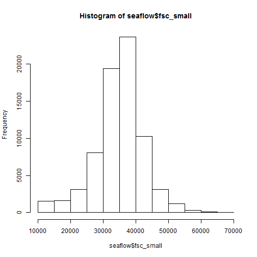 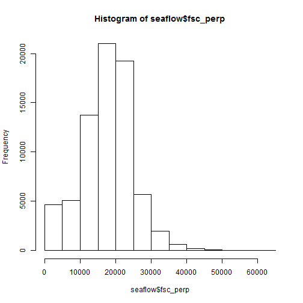 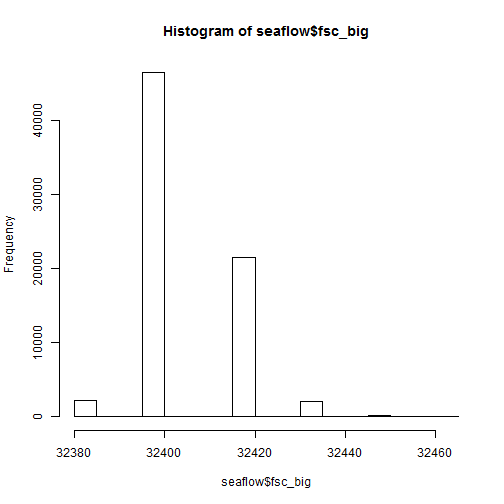 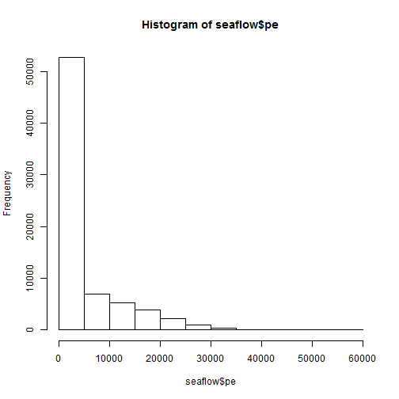 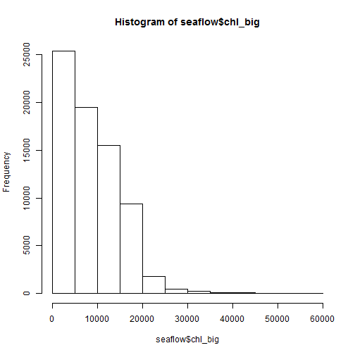 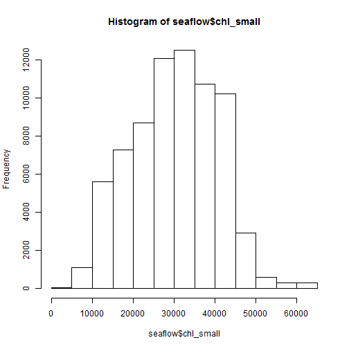 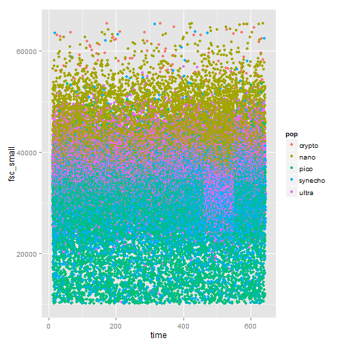 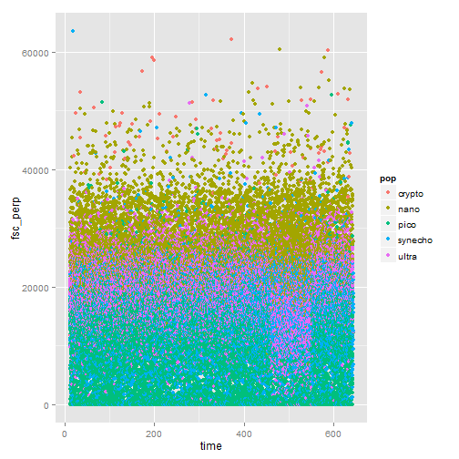 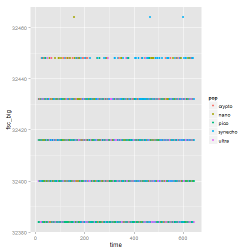 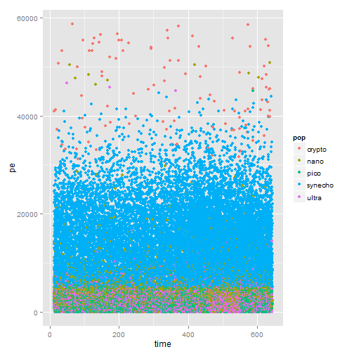 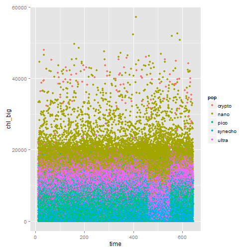 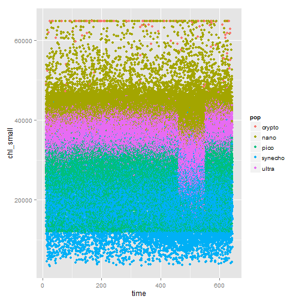 

Remove file 208


```r
#remove messy file (file_id 208
rmf_ind<-which(seaflow[,'file_id']==208)
seaflow<-seaflow[-rmf_ind]
```

Rerun SVM

```r
#partition
train_index<-createDataPartition(1:nrow(seaflow),1,.5,list=F)
trainset<-seaflow[train_index,]
testset<-seaflow[-train_index,]
#SVM
#model <- svm(fol, data=trainingdata)
model_svm<-svm(fol, data=trainset)
#testing
predict_svm<-predict(model_svm,newdata=testset)
accuracy_svm<-(sum(predict_svm==seaflow[labels(predict_svm),'pop']))/length(predict_svm)
print(accuracy_svm)
```

```
## [1] 0.9186365
```
